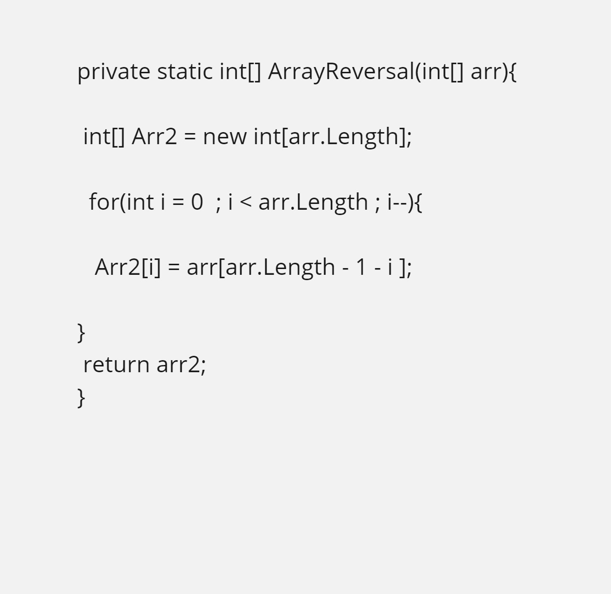
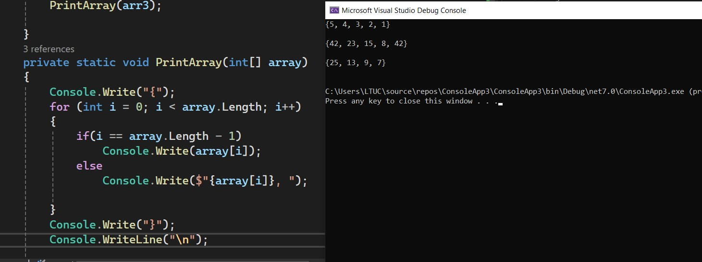
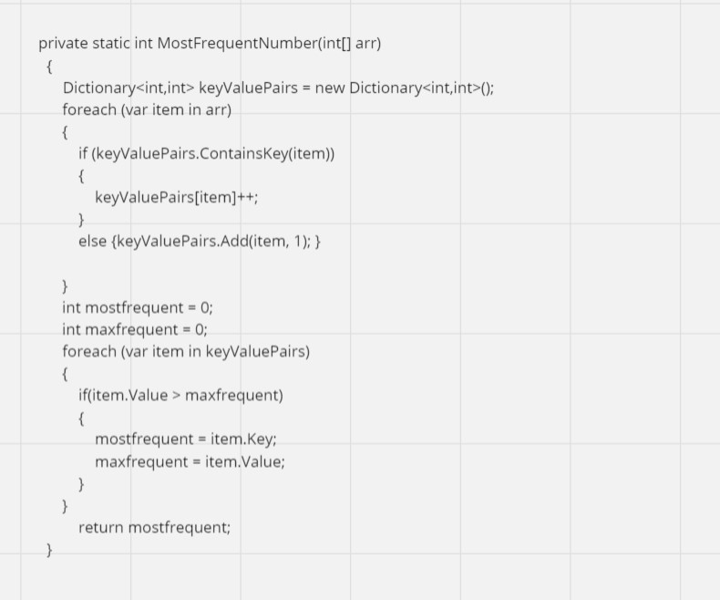
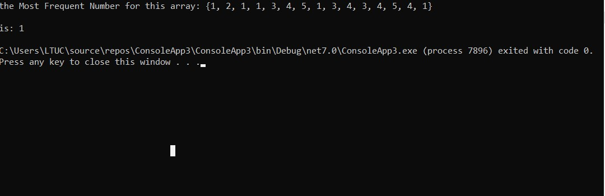

# whiteboard-challenges

## ArrayReversal

 this method takes an integer array as input and returns a new array containing the elements of the input array in reverse order
 It operates as follows:
 step1 : i declared a new integer array named arr with the same length as the input array array.
 step2 : i was created a for loop to iterates over each element of the input array.
 step3 : arr[i] = array[array.Length - i - 1] this line reverses the order of elements from the input array into the arr array.
 step4 : After the loop completes its return arr 
 
and this method to print an array

## Most Frequent Number

this method takes an interger array as input and return a Most Frequent Number for this array 
It operates as follows:
step1 : i  Created a dictionary to store each unique number in the array and its frequency count.
step2 : I created a for loop to populate a dictionary with each number from the input array as keys and their frequencies as values.
and The second foreach loop iterates through the dictionary to find the number with the highest frequency.
then return the most Frequency

